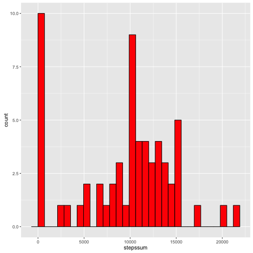
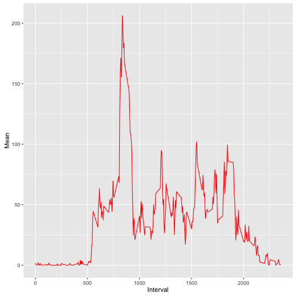
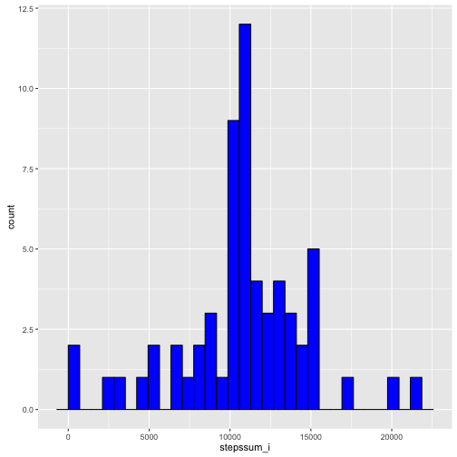
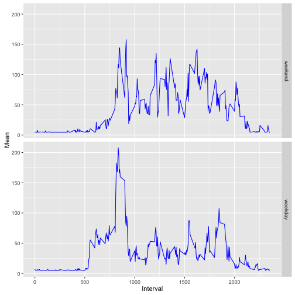

## Loading and preprocessing the data

This document was created on Freitag, 2016-03-11.

This section describes the data integration process. 


```r
library(dplyr)
library(ggplot2)

unzip("./activity.zip") # contains activity.csv
df_act <- tbl_df(read.csv("activity.csv", header = TRUE, sep = ","))
mutate(df_act, date=as.Date(date))
```

```
## Source: local data frame [17,568 x 3]
## 
##    steps       date interval
##    (int)     (date)    (int)
## 1     NA 2012-10-01        0
## 2     NA 2012-10-01        5
## 3     NA 2012-10-01       10
## 4     NA 2012-10-01       15
## 5     NA 2012-10-01       20
## 6     NA 2012-10-01       25
## 7     NA 2012-10-01       30
## 8     NA 2012-10-01       35
## 9     NA 2012-10-01       40
## 10    NA 2012-10-01       45
## ..   ...        ...      ...
```


## What is mean total number of steps taken per day?


```r
steps_sum <- df_act %>% 
        group_by(date) %>%
        summarise(stepssum=sum(steps,na.rm=TRUE))
c_mean <- round(mean(steps_sum$stepssum, na.rm = TRUE), 2)
c_med <- round(median(steps_sum$stepssum, na.rm = TRUE), 2)
```
The mean total number of steps taken per day is 9354.23 and the median is 1.0395 &times; 10<sup>4</sup>. 


```r
ggplot(steps_sum, aes(x=stepssum)) +
geom_histogram(colour="black", fill="red")
```



## What is the average daily activity pattern?


```r
# Grouping and computation of the mean 
steps_day <-  df_act %>%
        group_by(interval) %>%
        summarise(mean_int=mean(steps, na.rm = TRUE))

# Identify the interval with the maximum value of steps
c_max <- steps_day[which.max(steps_day$mean_int), ]    
# Time series plot of daily average 
ggplot(steps_day, aes(interval, mean_int)) + geom_line(color = "red") + xlab("Interval") + ylab("Mean")
```



The interval, that on average across all the days in the dataset, contains the maximum number of steps is 835 with an average of 206.1698113 steps.

## Imputing missing values
First of all, we have to compute the number of missing values. 


```r
# Load library that contains the impute() function
library(Hmisc)

# Number of datasets that have missing values
count_c <- sum(!complete.cases(df_act))
# Imputing missing values of steps with the mean value
df_act_i <- df_act %>%
        mutate(steps = impute(df_act$steps, mean))

steps_sum_i <- df_act_i %>% 
        group_by(date) %>%
        summarise(stepssum_i=sum(steps,na.rm=TRUE))


c_mean_i <- round(mean(steps_sum_i$stepssum_i, na.rm = TRUE), 2)

c_med_i <- round(median(steps_sum_i$stepssum_i, na.rm = TRUE), 2)
```
       
The are 2304 datasets with missing values in the sample. I used the mean to impute 
the missing values. The new mean and and median after the imputation process are 1.076619 &times; 10<sup>4</sup>
and 1.076619 &times; 10<sup>4</sup>.
The new histogram looks like this.


```r
ggplot(steps_sum_i, aes(x=stepssum_i)) +
geom_histogram(colour="black", fill="blue")
```




## Are there differences in activity patterns between weekdays and weekends?


```r
# Vector with weekdays in German language
# ATTENTION: You may have to use the English version to reproduce the results
weekday <- c('Montag', 'Dienstag', 'Mittwoch', 'Donnerstag', 'Freitag')
# weekday <- c('Monday', 'Tuesday', 'Wednesday', 'Thursday', 'Friday')

df_last <- df_act_i %>%
        mutate(wDay = factor((weekdays(as.Date(df_act_i$date)) %in% weekday),
                               levels=c(FALSE, TRUE), labels=c('weekend', 'weekday')))

# Grouping and computation of the mean 
steps_day_i <-  df_last %>%
        group_by(interval, wDay) %>%
        summarise(mean_int_i=mean(steps, na.rm = TRUE))
```


```r
# Time series plot of daily average 
ggplot(steps_day_i, aes(interval, mean_int_i)) + 
        geom_line(color = "blue") + 
        facet_grid(wDay ~ .) + xlab("Interval") + ylab("Mean")
```



